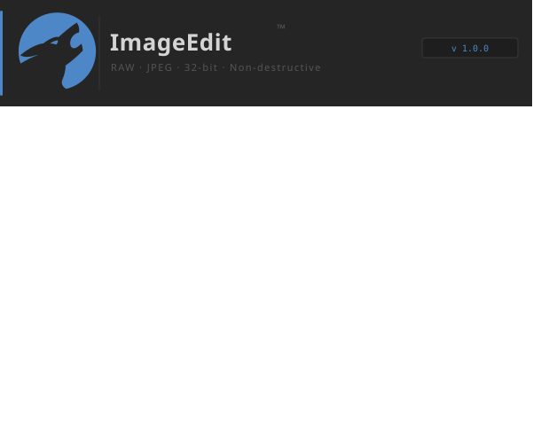

<div align="center">
  
</div>

[](https://www.gnu.org/licenses/gpl-3.0)

# ImageEdit #
Copyright (c) 2026 [Dev.Team- Amiram Azulay | Claude]

This project uses the following open source libraries:
- PyQt6 (GPL v3) — Riverbank Computing
- rawpy (MIT) — letmaik
- OpenCV (Apache 2.0) — OpenCV team
- NumPy (BSD 3-Clause) — NumPy team
- Pillow (HPND) — Jeffrey A. Clark

**Professional offline photo editor for RAW + JPEG files.**  
Built with PyQt6 · rawpy · OpenCV/NumPy · 32-bit float core · Non-destructive · Zero UI lag.

---

## Features

| Feature | Detail |
|---|---|
| **True 32-bit float pipeline** | All processing in `float32` linear light — no precision loss |
| **RAW support** | CR2, CR3, NEF, NRW, ARW, DNG, ORF, RW2, PEF, RAF, and more |
| **Non-destructive editing** | All edits stored as parameters, never modify source pixels |
| **50-step undo / redo** | Full history stack |
| **Async worker thread** | `QThread` render pipeline — UI never freezes |
| **Debounced rendering** | Rapid slider moves coalesced (80 ms) for zero-lag feel |
| **Live histogram** | R/G/B + Luminance channels, updated per render |
| **Zoom & pan canvas** | Mouse wheel zoom toward cursor · Alt+drag or middle-click pan |
| **Drag & drop** | Drop files or folders directly on the window |
| **Export** | JPEG (quality-selectable), PNG, 16-bit TIFF |

### Edit Controls

**Tone** — Exposure (±4 EV), Highlights, Shadows, Whites, Blacks, Brightness, Contrast  
**Color** — Temperature, Tint, Vibrance, Saturation  
**Detail** — Sharpness, Noise Reduction (Luminance + Color)  
**Optics** — Vignette  
**Transform** — Rotation (±180°), Flip H/V  

---

## Installation

### Prerequisites

- Python 3.10+
- A system with Qt6 libraries available

### Quick start

```bash
# 1. Clone / extract the project
cd ImageEdit

# 2. Create virtual environment
python3 -m venv .venv
source .venv/bin/activate       # Windows: .venv\Scripts\activate

# 3. Install dependencies
pip install -r requirements.txt

# 4. Run
python main.py

# Optional: open a file directly
python main.py path/to/photo.cr2
```

### Windows notes

```bat
python -m venv .venv
.venv\Scripts\activate
pip install -r requirements.txt
python main.py
```

### macOS notes

If PyQt6 installation fails, try:
```bash
pip install PyQt6 --no-binary PyQt6
```

---

## Running in VS Code

The project ships with `.vscode/launch.json`:

1. Open the `ImageEdit` folder in VS Code
2. Set the Python interpreter to `.venv/bin/python` (Ctrl+Shift+P → "Python: Select Interpreter")
3. Press **F5** or use the Run panel to launch **"Run ImageEdit"**

You can also use **"Open File in ImageEdit"** to pass the currently open editor file as an argument.

---

## Architecture

```
ImageEdit/
├── main.py                  Entry point, QApplication bootstrap
├── core/
│   ├── image_pipeline.py    32-bit float processing engine + EditParams
│   └── histogram.py         Fast per-channel histogram computation
├── workers/
│   ├── render_worker.py     QThread async render worker (latest-wins)
│   ├── load_worker.py       QThread async file loader
│   └── export_worker.py     QThread async file exporter
├── ui/
│   ├── main_window.py       Orchestration, menus, toolbar, layout
│   ├── image_canvas.py      Zoom/pan display canvas
│   ├── histogram_widget.py  Live histogram painter
│   ├── edit_panel.py        Slider-based edit controls
│   └── file_panel.py        File browser + filmstrip
└── resources/
    └── dark.qss             Professional dark Qt stylesheet
```

### Render pipeline flow

```
User moves slider
    └─► EditParams updated
    └─► Debounce timer started (80 ms)
        └─► RenderWorker.request_render()       ← QThread wakeup
            └─► pipeline.render(scale)          ← float32 ops
            └─► histogram.compute()             ← per-channel
            └─► rendered_ready signal           ← back to UI thread
                └─► canvas.set_image()
                └─► histogram.update_histogram()
```

No UI thread blocking at any stage.

---

## Keyboard Shortcuts

| Key | Action |
|---|---|
| `Ctrl+O` | Open file |
| `Ctrl+S` | Export / Save |
| `Ctrl+Z` | Undo |
| `Ctrl+Y` / `Ctrl+Shift+Z` | Redo |
| `F` | Fit image to window |
| `1` | 100% / 1:1 zoom |
| Mouse wheel | Zoom in/out (toward cursor) |
| Middle-click drag | Pan |
| Alt+drag | Pan |
| Double-click | Fit to window |

---

## Extending

**Add a new edit parameter:**

1. Add a field to `EditParams` in `core/image_pipeline.py`
2. Add the math in `ImagePipeline._apply_params()`
3. Add a slider row in `ui/edit_panel.py` → `_build_section()`
4. Add the reverse mapping in `EditPanel.load_params()`

**Add a new export format:**

Extend `ImagePipeline.export()` — it already handles JPEG, PNG, and 16-bit TIFF.

---

## Dependencies

| Package | Purpose |
|---|---|
| `PyQt6` | GUI framework |
| `rawpy` | RAW file decoding (libraw bindings) |
| `opencv-python` | Image I/O, color space conversion, filters |
| `numpy` | All array math (float32 pipeline) |
| `Pillow` | Optional fallback for exotic formats |
